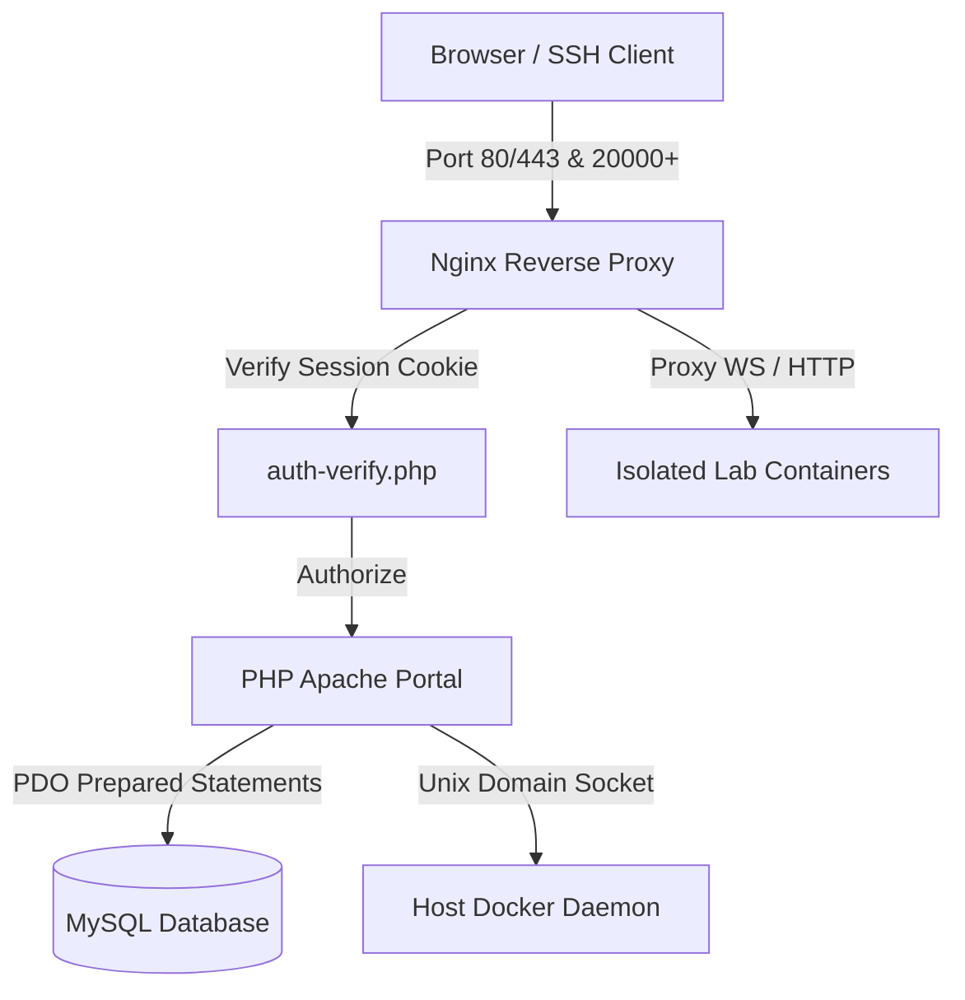

# CloudLab: Secure Cloud-Based Linux Lab Platform

CloudLab is an enterprise-grade, secure, and resource-constrained containerized laboratory platform designed for computer science students and developers. It provides instant, web-based VS Code IDE (code-server) instances and dedicated SSH terminal interfaces inside completely isolated environments.

---

## 🚀 Key Features

- **Personal Linux Workspaces:** Deploy isolated lab containers with persistent home directories (`/home/developer`).
- **Standard & Custom Environments:** Out-of-the-box support for Ubuntu 22.04 LTS, Kali Linux, Docker-in-Docker, Java Dev, MySQL, and Nginx.
- **Resource Constraints (DoS Mitigation):** Enforces strict safety limits on CPU cores, RAM allocation (MB), and GPU resources per container.
- **Media Mounting:** Enables loop mounting of CD/DVD ISO files inside active student workspaces.
- **Security Audits & Logs:** Full forensic tracking of authentication tries, container actions, script executions, and administrative events.
- **Stateless & Statefull Auth:** Dual authentication support via session-based cookies and cryptographically signed JWT Bearer tokens.
- **Multi-Factor Authentication (MFA):** Secondary validation layer via Time-based One-Time Passwords (TOTP).

---

## 🏗️ System Architecture

CloudLab uses a container-in-container orchestrator design proxying communication via Nginx.



### Network Topology
- **Host System:** Mounts volume data and binds ports `80` (Web Proxy) and `20000+` (SSH port-forward mapping dynamically per user).
- **Internal Docker Network (`linux-lab-net`):** Connects the `mysql-db`, `web-app`, and `nginx-proxy` services with student containers.
- **Access Control:** User containers run in non-privileged mode (least-privilege isolation) preventing container breakouts or lateral host access.

---

## 🛠️ Tech Stack

- **Frontend:** Responsive Vanilla CSS, Tailwind CSS, FontAwesome Icons, HTML5, Outfit typography.
- **Backend Portals & APIs:** PHP 8.2 (running on Apache), PDO prepared transactions, secure session cookies, Argon2id passwords.
- **Orchestration & Virtualization:** Docker Engine, Docker Compose, Docker API via Unix Socket (`/var/run/docker.sock`).
- **Proxy Server:** Nginx Alpine.
- **Datastore:** MySQL 8.0 Engine.

---

## 🔒 Security Hardening Standards

The project integrates advanced security controls complying with **OWASP Top 10** and **NIST SSDF**:

1. **Brute-Force Protection:** Restricts login attempts; locks accounts for 15 minutes after 5 consecutive failures.
2. **Two-Factor Authentication (2FA):** Standard RFC 6238 TOTP verification code challenge.
3. **CSRF Validation:** Encrypted token validation on all stateful forms and AJAX commands.
4. **API Rate Limiting:** Database-backed token-bucket style rate limiters restricting IP requests (e.g. 5 auth/min).
5. **Least-Privilege containers:** Switched student containers from privileged mode to unprivileged, restricting root capabilities.
6. **Malware Upload Filters:** Validates ISO size (<2GB), MIME type (`application/x-cd-image`), and verifies the ISO-9660 signature (`CD001` magic bytes at offset 32769).
7. **Web Directory Lockdown:** Integrates `.htaccess` in the upload folder to completely disable script handlers.
8. **Exception Masking:** Intercepts system faults globally to prevent raw database configuration leaks.

---

## 📦 Project Directory Structure

```text
cloud_cli/
├── db/
│   └── schema.sql             # SQL Database setup schemas
├── images/                    # Dockerfiles for lab environments
│   ├── kali-linux/
│   ├── ubuntu-22.04/
│   └── ubuntu-docker/
├── nginx/
│   └── nginx.conf             # Proxy rules & WebSocket upgrade configs
├── web/                       # Main Web Application & API files
│   ├── api/                   # Hardened REST endpoints
│   ├── includes/              # Libraries (JWT, TOTP, Security, DB, Docker)
│   ├── admin.php              # Administrative control center
│   ├── dashboard.php          # User control panel
│   └── index.php              # Secure login interface
├── .env                       # Environment variables configuration
├── docker-compose.yml         # Core system services builder
├── setup.ps1                  # Auto-setup script for Windows (PowerShell)
└── setup.sh                   # Auto-setup script for Linux (Bash)
```

---

## ⚙️ Setup & Installation

### Prerequisites
- Docker Desktop (Windows/macOS) or Docker Engine (Linux).
- Docker Compose v2.

### 1. Environment Configuration
Create a `.env` file in the root directory:
```env
ADMIN_PASSWORD=your_secure_admin_password
DB_NAME=linux_lab
DB_USER=lab_user
DB_PASSWORD=lab_password
DB_ROOT_PASSWORD=root_password
```

### 2. Auto-Deployment

#### Windows (PowerShell)
Open an elevated PowerShell console in the project root:
```powershell
Set-ExecutionPolicy Bypass -Scope Process
./setup.ps1
```

#### Linux/macOS (Bash)
Run the shell setup script:
```bash
chmod +x setup.sh
./setup.sh
```

The script will automatically:
1. Build the base user container images.
2. Spin up the Database, PHP Application, and Nginx proxy.
3. Sync environment credentials.
4. Initialize database schemas.

Open [http://localhost](http://localhost) in your browser to access the portal.

### 3. Lab Environment Image Building

By default, the setup scripts build only the basic Ubuntu environment. You can build specific lab environment images manually using Docker Compose:

* **Build only the basic Ubuntu lab image (`lab-ubuntu`):**
  This builds the standard clean Ubuntu 22.04 environment with SSH and VS Code support:
  ```bash
  docker compose --profile lab-images build lab-ubuntu
  ```

* **Build only the Ubuntu with Docker lab image (`lab-docker`):**
  This builds the Ubuntu environment equipped with Docker-in-Docker (DinD) capabilities and privileged access:
  ```bash
  docker compose --profile lab-images build lab-docker
  ```

* **Build all available Ubuntu lab images at once:**
  This builds all configured environments (standard Ubuntu, Docker, Java, MySQL, Nginx, and n8n):
  ```bash
  docker compose --profile lab-images build
  ```

---

## 📂 API Reference

All backend APIs are protected by rate limits and session verification (or JWT tokens).

### 1. Authentication
* **Endpoint:** `POST /api/auth.php?action=login`
  * **Payload:** `username`, `password`, `csrf_token`
  * **Response:** Redirects to dashboard/admin panel or redirects to MFA verification screen.
* **Endpoint:** `POST /api/auth.php?action=mfa_verify`
  * **Payload:** `mfa_code`, `csrf_token`
  * **Response:** Logs user in if code matches active TOTP token.
* **Endpoint:** `POST /api/auth.php?action=register`
  * **Payload:** `username`, `email`, `password`, `confirm_password`, `lab_type`, `csrf_token`
  * **Response:** Registers account, issues simulation email activation token.

### 2. MFA Management
* **Endpoint:** `POST /api/auth-mfa.php?action=enable`
  * **Payload:** `mfa_code`, `csrf_token`
  * **Response:** Enables TOTP MFA check on login.
* **Endpoint:** `POST /api/auth-mfa.php?action=disable`
  * **Payload:** `mfa_code`, `csrf_token`
  * **Response:** Resets MFA secret and disables 2FA challenges.

### 3. Container Controls
* **Endpoint:** `GET /api/container.php?action={start|stop|restart}&csrf_token={token}`
  * **Response:** Starts, stops, or restarts the container. Returns active container status.

### 4. Admin Actions
* **Endpoint:** `POST /api/admin-action.php?action=install_software`
  * **Payload:** `user_id`, `package`, `csrf_token`
  * **Response:** Triggers remote `apt-get install` inside the student container.
* **Endpoint:** `POST /api/admin-action.php?action=run_script`
  * **Payload:** `user_id`, `script`, `csrf_token`
  * **Response:** Executes custom bash script inside user container.
* **Endpoint:** `POST /api/admin-action.php?action=upload_iso`
  * **Payload:** `iso_file` (file object), `csrf_token`
  * **Response:** Sanitizes and uploads ISO media safely.

---

## 🛠️ Maintenance & Administration

### View Security Audit Trail
Log in to the database container to inspect security logs:
```sql
SELECT * FROM audit_logs ORDER BY created_at DESC LIMIT 50;
```

### Stop All System Services
To shutdown all services and clean up network resources:
```bash
docker compose down
```

---

## 📚 Academic Reference & Theoretical Foundation

This platform incorporates architectural principles and resource allocation concepts from recent research in **End-Edge-Cloud Collaborative Systems**:

### 📄 Referenced IEEE Publication
* **Title:** Distributed Resource Allocation and Mixed Task Offloading for End-Edge-Cloud Collaborative Systems
* **Domain:** Multi-Tier Cloud Computing, Resource Allocation & Computation Offloading

#### 📝 Paper Abstract
> Multi-tier computation offloading is crucial to address capacity constraints and improve flexibility for mobile devices. However, existing research on multi-layer computing offloading faces challenges like inefficient resource utilization and poor scalability, particularly in handling diverse computational tasks. To address these challenges, this paper proposes a distributed resource allocation and mixed task offloading framework for end-edge-cloud collaborative systems that support partial and full task offloading modes. First, we propose a three-tier computing architecture and formulate a task-offloading utility maximization problem by jointly optimizing mixed task-offloading and resource allocation. The proposed problem is a mixed integer nonlinear program (MINLP), which we solve by decomposing it into two subproblems resource allocation and task offloading. Edge computing resources and bandwidth allocation can be independently optimized at each edge node with a fixed task offloading strategy. Cloud computing resource allocation, while convex, involves a global constraint, which we solve in a decentralized manner using a multi-agent optimization approach. Then, we propose a joint task offloading and resource allocation optimization algorithm, CNO-TORA, to obtain the solution to the formulated problem. The algorithm is supported by strong theoretical guarantees and is almost surely convergent to a globally optimal solution. Experimental results on a real dataset demonstrate that our algorithm is scalable to large-scale networks and outperforms baselines, achieving improvements in average system utility ranging from 4.01%-28.15%.

#### 💡 Relevance to CloudLab Architecture
1. **Three-Tier Computing Architecture:** Mirrors CloudLab's 3-tier topology connecting Client Devices / Browsers (End) to Nginx Proxy & Web Orchestrator (Edge) and Isolated Docker Workspaces & Database Engine (Cloud).
2. **Resource Allocation & Constraints:** Provides mathematical justification for enforcing per-container CPU (`cpu_limit`), Memory (`memory_limit`), and GPU (`gpu_limit`) constraints to optimize multi-tenant host utility and mitigate DoS attacks.
3. **Computation Offloading:** Validates the core paradigm of offloading resource-heavy compute tasks (code compilation, Docker-in-Docker execution, penetration testing suites) from resource-constrained user devices to isolated server containers.
